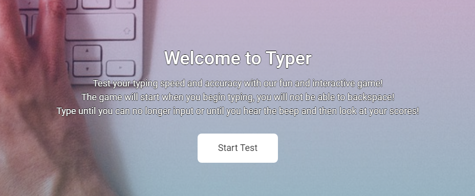
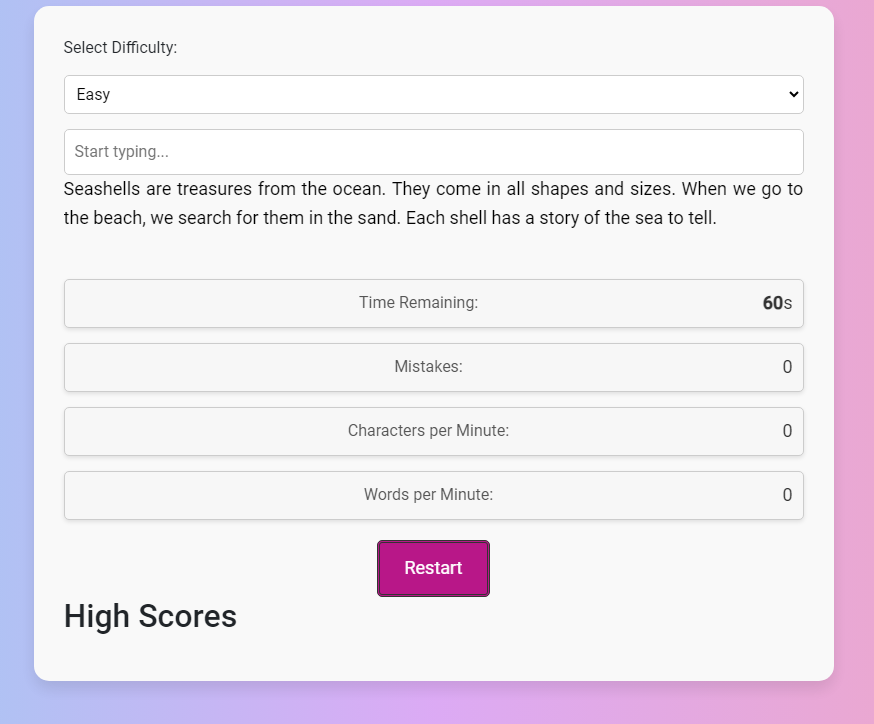

# **_Typer_**

Typer is a typing speed and accuracy testing website. The site is aimed generally at the casual typer, as it uses simple paragraphs to test your ability to type correctly. It has been aimed at casual typers with its less difficult paragraphs and fun layout.

Welcome to the journey through [Typer](https://jaeg99.github.io/Typer/index.html).

# Contents

* [**User Experience (UX)**](#user-experience-ux)
    * [User Stories](#user-stories)
    * [Wireframes](#wireframes)
    * [Site Structure](#site-structure)
    * [Design Choices](#design-choices)
    * [Typography](#typography)
    * [Colour Scheme](#colour-scheme)
* [**Features**](#features)
    * [**Home**](#Logo)
         * [Logo](#Logo)
         * [Start Button](#Start-Button)
         * [Game](#Game)
         * [Footer](#footer)
    * [**Future Features**](#future-features)
* [**Technologies Used**](#technologies-used)
* [**Testing**](#testing)
* [**Deployment**](#deployment)
* [**Credits**](#credits)
    * [**Content**](#content)
    * [**Media**](#media)
* [**Acknowledgements**](#acknowledgements)

# User Experience (UX)

## User Stories

* As a user, I want to be able to navigate through the whole site smoothly.
* As a user, I want to understand the purpose of the site upon loading it.
* As a user, I want to easily be able to contact Typer for more information.
* As a user, I want to share my scores on social media with links.
* As a user, I want to be able to see a clear result of my skills.
* As a user, I want to see clear ways to test my ability.

[Back to top](#contents)

## Wireframes

The wireframes for Typer were produced in [Balsamiq](https://balsamiq.com). My wireframes include full-width displays and also small and mobile displays. The final site does start slightly from the wireframes due to differences within the development of the site and my own abilities.

[Back to top](#contents)

## Site Structure

Typer website has two pages. The [home page](index.html) is the default loading page, and [Game](game.html) is the page with the typing game. The pages are all easily available from buttons on each page, with the Typer logo being a way to get back to the main page and then a button to go to the game page.

[Back to top](#contents)

## Design Choices

 * ### Typography
      The font chosen was 'Roboto', which falls back to cursive and sans-serif respectively. 
     * 'Roboto' was chosen for its ease of use and ability to read. The aim of the game means that the font for the paragraphs needs to be easy to read and comprehend in a timely manner. 
      

 * ### Colour Scheme
      The color scheme was something I took a lot of time to choose. The website being a typing game means that the base colors need to be able to work with the text when writing, but outside of that, I went for a modern theme and colorway to give it a sleek and stylish look.

[Back to top](#contents)

# Features

Typer site is set up to be welcoming and easy to use. The landing page is a very simple page with the logo at the top in the header acting as a link back to the index. The bottom has a footer which is a consistent theme throughout the pages with social buttons and an email for socials of the website.

## Existing Features  
  * ### Logo

    * Since the page is a very simple one with little navigation needed, the only present part is the clickable logo taking you back to the home page.

[Back to top](#contents)

  * ### Start Button

      * Located in the center of the index home page is the start button. This is a way for people to get prepared to go to the game page to start their typing game. It also gives a brief overview of the site's purpose.

[Back to top](#contents)

  * ### Game
    * This is the section for the main game of the site. The typing game will show a paragraph that will be generated from an array within the JS. This will then be static until the user presses the restart button. The program will begin the 60-second countdown when the user starts their typing.
    * When the 60 seconds is up, the user will be able to see their CPM, WPM, and their Accuracy in a percentage.
    * They will then be able to press the restart button to generate a new paragraph to try again.

[Back to top](#contents)

* ### Footer
    
    * The Footer is present at the bottom of both of the pages. It contains an email at which you are able to contact the site owner for any queries. 
    * The footer also shows four social FontAwesome logos all of which lead to their respective sites for people to share scores.

## Future Features 

* I would like to add a way to be able to save a high score for all of the stats which would also enable a way to make an account to save these scores.

* I would like to add a share button for scores after the timer is done with a results screen. This was planned as a feature but due to limitations it was cut from the project.

* I would like to add more difficulties for the paragraphs with an Easy, Medium, and Hard section for people to be able to test more difficult typing abilities. 

* I would like to add more variants to the game, maybe a code version where you need to type the certain code language or format properly and fast to test your code abilities.

[Back to top](#contents)

# Technologies Used
* [HTML5](https://html.spec.whatwg.org/) - provides the content and structure for the website.
* [CSS](https://www.w3.org/Style/CSS/Overview.en.html) - provides the styling.
* [Bootstrap](https://getbootstrap.com/) -  provided the scaling and box format.
* [Balsamiq](https://balsamiq.com/wireframes/) - used to create the wireframes.
* [Gitpod](https://www.gitpod.io/#get-started) - used to deploy the website.
* [Github](https://github.com/) - used to host and edit the website.

[Back to top](#contents)

# Testing

Please refer to [**_here_**](TESTING.md) for more information on testing Typer.

[Back to top](#contents)

# Deployment

### **To deploy the project**
The site was deployed to GitHub pages. The steps to deploy a site are as follows:
  1. In the GitHub repository, navigate to the **Settings** tab.
  2. Once in Settings, navigate to the **Pages** tab on the left-hand side.
  3. Under **Source**, select the branch to **master**, then click **save**.
  4. Once the master branch has been selected, the page will be automatically refreshed with a detailed ribbon display to indicate the successful deployment.

  The live link to the Github repository can be found here - https://github.com/JAEG99/Typer

### **To fork the repository on GitHub**
A copy of the GitHub Repository can be made by forking the GitHub account. This copy can be viewed and changes can be made to the copy without affecting the original repository. Take the following steps to fork the repository;
1. Log in to **GitHub** and locate the [repository](https://github.com/JAEG99/Typer).
2. On the right-hand side of the page inline with the repository name is a button called **'Fork'**, click on the button to create a copy of the original repository in your GitHub Account.

### **To create a local clone of this project**
The method for cloning a project from GitHub is below:

1. Under the repository’s name, click on the **code** tab.
2. In the **Clone with HTTPS** section, click on the clipboard icon to copy the given URL.

3. In your IDE of choice, open **Git Bash**.
4. Change the current working directory to the location where you want the cloned directory to be made.
5. Type **git clone**, and then paste the URL copied from GitHub.
6. Press **enter**, and the local clone will be created.

[Back to top](#contents)

# Credits
### Content

* The font came from [Google Fonts](https://fonts.google.com/).
* The layout is from [Bootstrap](https://getbootstrap.com/).
* The icons came from [Font Awesome](https://fontawesome.com/).
* [Balsamiq](https://balsamiq.com/wireframes/) was used to create the wireframes.
* The idea came from [CodingNepal](https://www.codingnepalweb.com/best-javascript-games-for-beginners/).
* The accuracy idea came from [Livechat](https://www.livechat.com/typing-speed-test/#/).
* The logo was made with [Adobe](https://www.adobe.com/express/create/logo).
* HTML, CSS, and JavaScript help came from [W3Schools](https://www.w3schools.com/).

### Media
* The photos all came from the developer, [James Gilliland].

[Back to top](#contents)

# Acknowledgments
The site was made a part of Project 2 for [Code Institute](https://codeinstitute.net/). I would like to thank my mentor [Precious Ijege], my tutor [Komal Karir], and I would like to thank the rest of my peers for helping me fix problems and for helping me with ideas and discussions.

James Gilliland 2023.

[Back to top](#contents)
