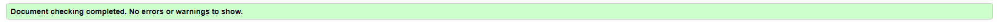

# Testing
## Code Validation
The Typer site has be throughly tested. All the code has been run through the [W3C html Validator](https://validator.w3.org/) and the [W3C CSS Validator](https://jigsaw.w3.org/css-validator/). There was a Button error on the indexc which I ammended, the CSS had two erros which were a very easy fix.

The HTML validator results for each page are below:

* Home page

* Projects page

* Inspiration page

* Contact page

* Form valiadtion page

The CSS validator results are below:

## Responsiveness Test

* The responsive design tests were carried out manually with [Google Chrome DevTools](https://developer.chrome.com/docs/devtools/) and [Responsive Design Checker](https://www.responsivedesignchecker.com/).

|        | Iphone SE | Galaxy S20 Ultra | iPhone 12 pro | iPad | iPad Pro | Display <1200px | Display >1200px |
|--------|---------|-----------|----------|------|----------|-----------------|-----------------|
| Render | pass    | pass      | pass     | pass | pass     | pass            | pass            |
| Images | pass    | pass      | pass     | pass | pass     | pass            | pass            |
| Links  | pass    | pass      | pass     | pass | pass     | pass            | pass            |

## Browser Compatibility

The Typer website underwent testing on various browsers, namely Google Chrome, Microsoft Edge, Safari, and Mozilla Firefox, and no discernible issues were observed from the user's perspective. The website's appearance, functionality, and responsiveness remained consistent across a diverse range of device sizes and browsers.

## Testing User Stories

* As a user I want to be able to navigate through the whole site smoothly.
    * On the home page you can see the lareg start button which will take you to the games page. The logo also has a hover box to show you can click it and naviagte back to the landing page.

     
* As a user I want to understand the purpose of the site upon loading it.
    * The landing page has flair text that easy shows what the site is about and what you can do on it and what it is for.

     
* As a user I want to easily be able to contact Typer for more information.
    * On the footer you can see our email to be able to reach out to us. There is also the social links to the soical pages and my Github.

     
* As a user I want to know how other peoples' experiences with Typer have been.
    * With the social media buttons you will be able to see other peoples scores when they post them and compare with your own.

     
* As a user I want to connect with Typer on social media.
    * In the footer you can see our media FontAwsome logos of which you can press to go to the social pages.

## Known Bugs
* ### Resolved

    * During validation two bugs became known during the validation stage, a brief description is below:

    * Home page - 
    
I used an a to be a button elemnt. I changed it so that the button was sperat and added a slight script in the HTML as a quick fix allowing it to work the same.

    * Inspiration page - 
    
The first issue was with the margin not having a value, this was a simple fix of deleting the CSS rule.

The 2nd issue was I used 'transition: 0.3' without specifying which CSS should be transitiond.  

## Additional Testing
### Lighthouse
The site was also tested using [Google Lighthouse](https://developers.google.com/web/tools/lighthouse) in Chrome Developer Tools to test each of the pages for:
* Performance - How the page performs whilst loading.
* Accessibility - Is the site acccessible for all users and how can it be improved.
* Best Practices - Site conforms to industry best practices.
* SEO - Search engine optimisation. Is the site optimised for search engine result rankings.

The Typer results are shown below

This shows that the site has a high performance. The higesth score being performance and the lowest being SEO.

Back to [README.md](./README.md#testing).
